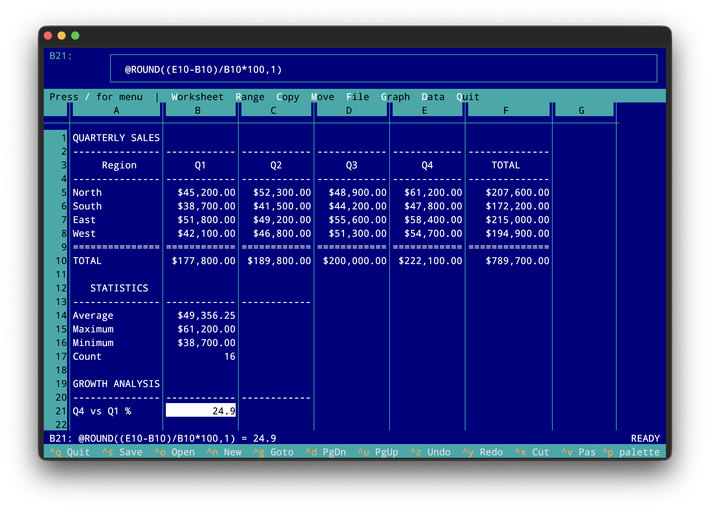
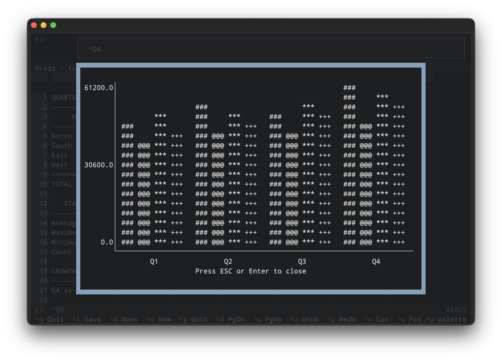
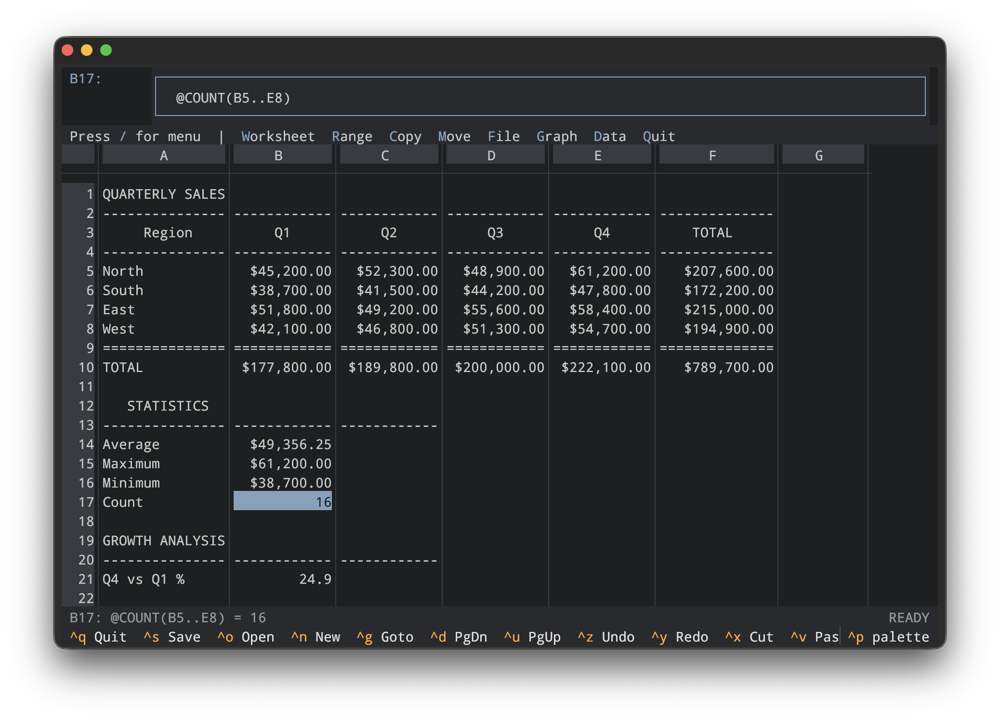

# Lotus 1-2-3 Clone

A fully-functional terminal-based spreadsheet application inspired by the legendary Lotus 1-2-3. Built with Python and the [Textual](https://textual.textualize.io/) TUI framework.

**This entire application was 100% coded by Claude Opus 4.5 using [Claude Code CLI](https://claude.ai/code), vibe coded over a weekend.**



> **Note**: This project is provided as a reference implementation and educational resource. It is not intended for active development or production use. See [Disclaimer](#disclaimer) below.

---

## Table of Contents

- [Features](#features)
- [Installation](#installation)
- [Quick Start Guide](#quick-start-guide)
- [Keyboard Shortcuts](#keyboard-shortcuts)
- [Menu System](#menu-system)
- [Working with Formulas](#working-with-formulas)
- [Creating Charts](#creating-charts)
- [Data Operations](#data-operations)
- [File Formats](#file-formats)
- [Themes](#themes)
- [Architecture](#architecture)
- [Running Tests](#running-tests)
- [Disclaimer](#disclaimer)
- [License](#license)

---

## Features

### Spreadsheet Core
- **Large Grid**: 256 columns (A-IV) × 65,536 rows
- **Cell References**: A1 notation with absolute/relative support (`$A$1`, `A1`, `$A1`, `A$1`)
- **Range References**: Multi-cell ranges (`A1:B10`)
- **Named Ranges**: Create and use named ranges in formulas
- **180+ Formula Functions**: Comprehensive function library across 9 categories
- **Dual Syntax**: Both `=SUM(...)` and Lotus-style `@SUM(...)` supported

### Text Alignment (Lotus 1-2-3 Style)
| Prefix | Alignment | Example |
|--------|-----------|---------|
| `'` | Left | `'Hello` |
| `"` | Right | `"Hello` |
| `^` | Center | `^Title` |
| `\` | Repeat/Fill | `\-` (fills cell with `-`) |

Numbers are right-aligned by default, text is left-aligned.

### Data Operations
- Sort (ascending/descending by column)
- Query with criteria ranges
- Fill (down, right, with series)
- Find and replace

### File Formats
| Format | Extension | Description |
|--------|-----------|-------------|
| JSON | `.json` | Native format with full feature support |
| WK1 | `.wk1` | Lotus 1-2-3 binary format (read/write) |
| CSV | `.csv` | Comma-separated values |
| TSV | `.tsv` | Tab-separated values |

### Charting
Text-based charts rendered in the terminal:
- Line charts
- Bar charts (vertical and horizontal)
- Stacked bar charts
- XY Scatter plots
- Pie charts
- Area charts



### User Interface
- **Lotus-style `/` Menu**: Hierarchical menu system
- **Multiple Themes**: Classic Lotus blue, Tomorrow Night, Mocha
- **Full Keyboard Navigation**: Vim-like efficiency
- **Range Selection**: Shift+Arrow or mouse drag
- **Undo/Redo**: Full history support
- **Copy/Cut/Paste**: Internal and OS clipboard integration



---

## Installation

Requires Python 3.11+ and [uv](https://docs.astral.sh/uv/).

```bash
# Clone the repository
git clone https://github.com/anthropics/lotus123.git
cd lotus123

# Install dependencies
uv sync
```

---

## Quick Start Guide

### Starting the Application

```bash
# Start with empty spreadsheet
uv run python main.py

# Open an existing file
uv run python main.py samples/sales_dashboard.json
uv run python main.py samples/sample1.json
```

### Basic Navigation

1. **Move around**: Use arrow keys to navigate between cells
2. **Jump to a cell**: Press `Ctrl+G` or `F5`, then type a cell reference like `A1` or `Z100`
3. **Scroll quickly**: Use `Page Up`/`Page Down` for vertical scrolling
4. **Go to start**: Press `Home` to go to column A, or `Ctrl+Home` to go to cell A1

### Entering Data

1. **Type directly**: Just start typing - the cell will enter edit mode automatically
2. **Edit existing cell**: Press `Enter` or `F2` to edit the current cell
3. **Confirm entry**: Press `Enter` to save your input
4. **Cancel editing**: Press `Escape` to discard changes

### Entering Numbers and Text

```
123         → Stored as number, right-aligned
Hello       → Stored as text, left-aligned
'123        → Stored as text (apostrophe prefix), left-aligned
^Title      → Centered text
"Right      → Right-aligned text
\-          → Repeating character (fills cell with dashes)
```

### Entering Formulas

Formulas start with `=` or the Lotus-style `@`:

```
=A1+B1          → Add two cells
=SUM(A1:A10)    → Sum a range
@SUM(A1:A10)    → Lotus-style syntax
=A1*1.1         → Multiply by constant
```

### Selecting Ranges

1. **With keyboard**: Hold `Shift` and use arrow keys to extend selection
2. **With mouse**: Click and drag to select a range
3. **View selection**: Selected cells are highlighted

### Copy, Cut, and Paste

1. Select a range of cells
2. Press `Ctrl+C` to copy or `Ctrl+X` to cut
3. Navigate to the destination
4. Press `Ctrl+V` to paste

### Saving and Opening Files

- **Save**: Press `Ctrl+S` (saves to current file, or prompts for filename)
- **Save As**: Use menu `/` → `File` → `Save`
- **Open**: Press `Ctrl+O` or use menu `/` → `File` → `Retrieve`
- **New**: Press `Ctrl+N` for a blank spreadsheet

### Using the Menu

Press `/` to open the Lotus-style menu bar. Navigate with arrow keys and press `Enter` to select.

---

## Keyboard Shortcuts

### Navigation
| Key | Action |
|-----|--------|
| Arrow keys | Move cursor |
| `Page Up/Down` | Scroll vertically |
| `Home` | First column |
| `End` | Last used column |
| `Ctrl+Home` | Cell A1 |
| `Ctrl+G` / `F5` | Go to cell |

### Editing
| Key | Action |
|-----|--------|
| `Enter` / `F2` | Edit cell |
| `Delete` | Clear cell |
| `Escape` | Cancel edit |
| `F4` | Toggle absolute reference ($) |
| `F9` | Recalculate all |

### Selection
| Key | Action |
|-----|--------|
| `Shift+Arrow` | Extend selection |
| `Ctrl+Shift+End` | Select to last cell |

### Clipboard
| Key | Action |
|-----|--------|
| `Ctrl+C` | Copy |
| `Ctrl+X` | Cut |
| `Ctrl+V` | Paste |

### File Operations
| Key | Action |
|-----|--------|
| `Ctrl+S` | Save |
| `Ctrl+O` | Open |
| `Ctrl+N` | New |
| `Ctrl+Q` | Quit |

### Other
| Key | Action |
|-----|--------|
| `/` | Open menu |
| `Ctrl+Z` | Undo |
| `Ctrl+Y` | Redo |
| `Ctrl+T` | Change theme |
| `F3` | Find |

---

## Menu System

Press `/` to access the Lotus-style menu:

```
┌─ Worksheet ─┬─ Range ─┬─ Copy ─┬─ Move ─┬─ File ─┬─ Print ─┬─ Graph ─┬─ Data ─┬─ System ─┬─ Quit ─┐
```

### Menu Structure
- **Worksheet**: Insert/delete rows/columns, column width, global settings, erase
- **Range**: Format cells, set labels, name ranges, justify text
- **Copy**: Copy cells to new location (Lotus-style: prompts for destination)
- **Move**: Move cells to new location
- **File**: New, open, save, import/export (CSV, TSV, WK1)
- **Graph**: Create and view charts (line, bar, pie, etc.)
- **Data**: Sort, query, fill operations
- **Quit**: Exit application

---

## Working with Formulas

### Basic Formulas

```
=A1+B1              # Addition
=A1-B1              # Subtraction
=A1*B1              # Multiplication
=A1/B1              # Division
=A1^2               # Power (A1 squared)
=(A1+B1)*C1         # Parentheses for order of operations
```

### Using Functions

Functions can use `=` or Lotus-style `@` prefix:

```
=SUM(A1:A10)        # Sum of range
@AVG(B1:B20)        # Average (Lotus-style)
=MAX(A1:A100)       # Maximum value
=MIN(A1:A100)       # Minimum value
=COUNT(A1:A50)      # Count of numbers
=COUNTA(A1:A50)     # Count of non-empty cells
```

### Conditional Logic

```
=IF(A1>100,"High","Low")              # Simple IF
=IF(A1>100,"High",IF(A1>50,"Med","Low"))  # Nested IF
=AND(A1>0,A1<100)                     # Logical AND
=OR(A1="Yes",A1="Y")                  # Logical OR
```

### Text Functions

```
=LEFT(A1,3)             # First 3 characters
=RIGHT(A1,2)            # Last 2 characters
=MID(A1,2,4)            # 4 chars starting at position 2
=LEN(A1)                # Length of text
=UPPER(A1)              # Convert to uppercase
=LOWER(A1)              # Convert to lowercase
=TRIM(A1)               # Remove extra spaces
=CONCATENATE(A1," ",B1) # Join text
=A1&" "&B1              # Join text (alternative)
```

### Lookup Functions

```
=VLOOKUP(A1,D1:E100,2)      # Vertical lookup
=HLOOKUP(A1,A1:Z2,2)        # Horizontal lookup
=INDEX(A1:C10,3,2)          # Value at row 3, col 2
=MATCH(100,A1:A50,0)        # Find position of value
```

### Date and Time

```
=TODAY()                # Current date
=NOW()                  # Current date and time
=DATE(2024,12,25)       # Create date
=YEAR(A1)               # Extract year
=MONTH(A1)              # Extract month
=DAY(A1)                # Extract day
```

### Financial Functions

```
=PMT(0.05/12,360,200000)    # Monthly payment (5% APR, 30yr, $200k)
=PV(0.08,10,1000)           # Present value
=FV(0.06,5,0,1000)          # Future value
=NPV(0.1,A1:A5)             # Net present value
=IRR(A1:A10)                # Internal rate of return
```

### Cell References

```
A1          # Relative reference (adjusts when copied)
$A$1        # Absolute reference (never adjusts)
$A1         # Mixed: column absolute, row relative
A$1         # Mixed: column relative, row absolute
```

**Tip**: Press `F4` while editing to cycle through reference types.

### Named Ranges

1. Select a range of cells
2. Press `/` → `Range` → `Name`
3. Enter a name (e.g., `SALES`)
4. Use in formulas: `=SUM(SALES)`

---

## Creating Charts

### Step-by-Step Chart Creation

1. **Enter your data** in a tabular format:
   ```
        A          B        C        D
   1    Category   Q1       Q2       Q3
   2    North      1000     1200     1100
   3    South      800      900      950
   4    East       1200     1300     1400
   ```

2. **Open the Graph menu**: Press `/` → `Graph`

3. **Set the chart type**: Select `Type` and choose:
   - `Line` - Line chart
   - `Bar` - Vertical bar chart
   - `Stacked-Bar` - Stacked bar chart
   - `XY` - Scatter plot
   - `Pie` - Pie chart

4. **Set the X-axis range** (labels):
   - Select `X` from the menu
   - Select the range containing your labels (e.g., `A2:A4`)

5. **Set the data series** (A through F):
   - Select `A` from the menu
   - Select your first data series (e.g., `B2:B4`)
   - Repeat for series B, C, etc. as needed

> **Tip**: If you select a range in the spreadsheet before opening the Graph menu and choosing X, A, B, etc., the selected range will automatically be used as the series input without prompting you to enter it again.

6. **View the chart**: Select `View` to display the chart

7. **Optional - Set titles**:
   - Use `Options` → `Titles` to add chart title and axis labels

### Example: Creating a Bar Chart

```
1. Enter data:
   A1: Month    B1: Sales
   A2: Jan      B2: 5000
   A3: Feb      B3: 6200
   A4: Mar      B4: 5800
   A5: Apr      B5: 7100

2. Press / → Graph → Type → Bar

3. Press / → Graph → X
   Select A2:A5 (month labels)

4. Press / → Graph → A
   Select B2:B5 (sales data)

5. Press / → Graph → View
```

### Chart Types

| Type | Best For |
|------|----------|
| Line | Trends over time |
| Bar | Comparing categories |
| Stacked Bar | Part-to-whole comparisons |
| XY Scatter | Correlation between variables |
| Pie | Proportions of a whole |

---

## Data Operations

### Sorting Data

1. **Select your data range** (including headers if present)
2. Press `/` → `Data` → `Sort`
3. **Set the primary sort column**:
   - Enter the column letter to sort by
4. **Choose order**: Ascending (A) or Descending (D)
5. **Optional**: Set secondary sort column

**Example**: Sort a list by column B in descending order:
```
1. Select A1:C100 (your data range)
2. / → Data → Sort
3. Primary key: B
4. Order: D (descending)
```

### Filling Data

#### Fill Down
Copy the top cell's value/formula down through a selected range:
1. Enter a value or formula in the first cell
2. Select the range to fill (including the source cell)
3. Press `/` → `Data` → `Fill` → `Down`

#### Fill Right
Same as Fill Down, but copies rightward:
1. Enter a value in the leftmost cell
2. Select the range
3. Press `/` → `Data` → `Fill` → `Right`

#### Fill with Series
Create a sequence of numbers or dates:
1. Select the range to fill
2. Press `/` → `Data` → `Fill` → `Series`
3. Enter start value, step, and stop value

### Querying Data (Database Functions)

Set up a database query to find and extract records:

1. **Set up your database range** (your data with headers):
   ```
   A1: Name    B1: Dept    C1: Salary
   A2: John    B2: Sales   C2: 50000
   A3: Jane    B3: IT      C3: 65000
   ...
   ```

2. **Create a criteria range** (headers + conditions):
   ```
   E1: Dept    F1: Salary
   E2: Sales   F2: >40000
   ```

3. **Set up the query**:
   - Press `/` → `Data` → `Query`
   - `Input`: Select your database range (A1:C100)
   - `Criteria`: Select your criteria range (E1:F2)
   - `Output`: Select where to put results

4. **Execute**:
   - `Find`: Find matching records
   - `Extract`: Copy matching records to output range

### Database Functions

Use these functions to calculate values based on criteria:

```
=DSUM(A1:C100,C1,E1:F2)     # Sum of Salary where criteria match
=DAVG(A1:C100,C1,E1:F2)     # Average Salary where criteria match
=DCOUNT(A1:C100,C1,E1:F2)   # Count matching records
=DMAX(A1:C100,C1,E1:F2)     # Maximum matching value
=DMIN(A1:C100,C1,E1:F2)     # Minimum matching value
```

---

## File Formats

### Native JSON Format

The default format with full feature support:
- All formulas preserved
- Column widths and formatting saved
- Named ranges included
- Chart definitions saved

```bash
# Save/open JSON files
uv run python main.py myfile.json
```

### WK1 Format (Lotus 1-2-3 Binary)

> **Note on WK1 Support**: The WK1 file format support was implemented to help preserve knowledge of this historical file format. The WK1 format was the native binary format used by Lotus 1-2-3 versions 1.x and 2.x, and represents an important piece of computing history.
>
> **Accuracy Disclaimer**: While we've made best efforts to implement the WK1 format correctly based on available documentation, **results may not be 100% accurate**. Some features may not be fully supported, and edge cases may exist. If you're working with important WK1 files, please verify the imported data carefully.

Import/Export via menu:
- Press `/` → `File` → `Import` → `WK1`
- Press `/` → `File` → `Export` → `WK1`

**What is preserved in WK1:**
- Cell values (numbers, strings, formulas)
- Formulas (compiled to WK1 bytecode format)
- Column widths
- Named ranges
- Calculation mode (manual/automatic)
- Calculation order (natural/column/row)
- Cell format codes (fixed, scientific, currency, percent, comma, date/time)

**What is NOT preserved in WK1:**
- **Row heights** - WK1 format does not support custom row heights
- **Frozen rows/columns** - Window settings are not exported
- **Charts** - WK1 does not support embedded charts
- **Modern functions** - Only functions available in Lotus 1-2-3 R2 can be exported; modern functions will be saved as their calculated values
- **Cell protection** - Protection flags are decoded but not fully implemented
- **Hidden columns** - Column visibility settings are not preserved

**WK1 Format Limitations:**
- Maximum grid size: 256 columns × 8,192 rows (original Lotus 1-2-3 limits)
- String literals in formula bytecode are not fully supported
- Some complex formula expressions may not round-trip perfectly

### CSV/TSV Import/Export

For data exchange with other applications:

**Import**:
1. Press `/` → `File` → `Import`
2. Select `Text`
3. Choose delimiter (Comma, Tab, or custom)
4. Select the file

**Export**:
1. Press `/` → `File` → `Export`
2. Select `Text`
3. Choose format (CSV or TSV)
4. Enter filename

> **Important**: When exporting to CSV or TSV, **formulas are converted to their calculated values**. The exported file contains only the results, not the original formulas. This is standard behavior for data interchange formats.

**What is preserved in CSV/TSV:**
- All cell values (as calculated results)
- Text content

**What is NOT preserved in CSV/TSV:**
- Formulas (converted to values)
- Cell formatting and alignment
- Column widths
- Named ranges
- Charts

---

## Themes

Three built-in color themes:

| Theme | Description |
|-------|-------------|
| **Lotus 1-2-3** | Classic blue theme faithful to the original |
| **Tomorrow Night** | Modern dark theme with muted colors |
| **Mocha** | Catppuccin Mocha color palette |

Switch themes with `Ctrl+T` or via the menu.

---

## Architecture

```
lotus123/
├── app.py              # Main TUI application
├── core/               # Data model (cell, spreadsheet, formatting)
├── formula/            # Formula engine (parser, evaluator, functions)
├── ui/                 # UI components (grid, menus, dialogs, themes)
├── data/               # Data operations (sort, query, fill)
├── io/                 # File I/O (JSON, CSV, TSV, WK1)
├── charting/           # Chart renderers
├── handlers/           # Application event handlers
└── utils/              # Utilities (undo/redo, clipboard)
```

---

## Formula Functions Reference

### Math (27 functions)
`SUM`, `ABS`, `INT`, `ROUND`, `MOD`, `SQRT`, `POWER`, `SIGN`, `TRUNC`, `CEILING`, `FLOOR`, `FACT`, `GCD`, `LCM`, `EXP`, `LN`, `LOG`, `SIN`, `COS`, `TAN`, `ASIN`, `ACOS`, `ATAN`, `ATAN2`, `DEGREES`, `RADIANS`, `PI`, `RAND`

### Statistical (32 functions)
`AVG`, `AVERAGE`, `COUNT`, `COUNTA`, `COUNTBLANK`, `MIN`, `MAX`, `MEDIAN`, `STD`, `STDEV`, `VAR`, `MODE`, `LARGE`, `SMALL`, `RANK`, `PERCENTILE`, `QUARTILE`, `GEOMEAN`, `HARMEAN`, `PRODUCT`, `SUMPRODUCT`, `SUMSQ`, `COMBIN`, `PERMUT`

### String (29 functions)
`LEFT`, `RIGHT`, `MID`, `LENGTH`, `LEN`, `FIND`, `SEARCH`, `REPLACE`, `SUBSTITUTE`, `UPPER`, `LOWER`, `PROPER`, `TRIM`, `CLEAN`, `VALUE`, `STRING`, `CHAR`, `CODE`, `CONCAT`, `CONCATENATE`, `EXACT`, `REPEAT`, `REPT`, `TEXT`

### Logical (24 functions)
`IF`, `TRUE`, `FALSE`, `AND`, `OR`, `NOT`, `XOR`, `ISERR`, `ISERROR`, `ISNA`, `ISNUMBER`, `ISSTRING`, `ISTEXT`, `ISBLANK`, `ISLOGICAL`, `ISEVEN`, `ISODD`, `NA`, `ERR`, `IFERROR`, `IFNA`, `SWITCH`, `CHOOSE`

### Lookup (14 functions)
`VLOOKUP`, `HLOOKUP`, `INDEX`, `LOOKUP`, `MATCH`, `ADDRESS`, `INDIRECT`, `COLUMNS`, `COLS`, `COLUMN`, `ROWS`, `ROW`, `OFFSET`, `TRANSPOSE`

### Date/Time (17 functions)
`DATE`, `DATEVALUE`, `DAY`, `MONTH`, `YEAR`, `TIME`, `TIMEVALUE`, `HOUR`, `MINUTE`, `SECOND`, `NOW`, `TODAY`, `WEEKDAY`, `DAYS`, `EDATE`, `EOMONTH`, `YEARFRAC`

### Financial (14 functions)
`PMT`, `PV`, `FV`, `NPV`, `IRR`, `RATE`, `NPER`, `CTERM`, `SLN`, `SYD`, `DDB`, `IPMT`, `PPMT`, `TERM`

### Database (13 functions)
`DSUM`, `DAVG`, `DCOUNT`, `DCOUNTA`, `DGET`, `DMAX`, `DMIN`, `DSTD`, `DSTDEV`, `DVAR`

### Info (10 functions)
`TYPE`, `CELL`, `ISNUMBER`, `ISSTRING`, `ISERR`, `ISNA`, `INFO`, `ISFORMULA`

---

## Running Tests

```bash
# Run all tests
uv run pytest

# Run with coverage
uv run pytest --cov=lotus123

# Run specific test file
uv run pytest tests/core/test_spreadsheet.py

# Run specific test
uv run pytest tests/core/test_spreadsheet.py::TestCellAlignment -v
```

---

## Sample Files

The `samples/` directory contains example spreadsheets:
- `sales_dashboard.json` - Sales report with formatting examples
- `sample1.wk1` - Lotus 1-2-3 WK1 format example
- `sample1.csv` / `sample1.tsv` - Delimited text format examples
- `example.wk1` - Additional WK1 test file

---

## Disclaimer

**THIS SOFTWARE IS PROVIDED "AS IS", WITHOUT WARRANTY OF ANY KIND, EXPRESS OR IMPLIED, INCLUDING BUT NOT LIMITED TO THE WARRANTIES OF MERCHANTABILITY, FITNESS FOR A PARTICULAR PURPOSE AND NONINFRINGEMENT.**

**IN NO EVENT SHALL THE AUTHORS OR COPYRIGHT HOLDERS BE LIABLE FOR ANY CLAIM, DAMAGES OR OTHER LIABILITY, WHETHER IN AN ACTION OF CONTRACT, TORT OR OTHERWISE, ARISING FROM, OUT OF OR IN CONNECTION WITH THE SOFTWARE OR THE USE OR OTHER DEALINGS IN THE SOFTWARE.**

### Important Notes

1. **Reference Implementation**: This project is provided as a reference implementation and educational resource. It is **not intended for active development or production use**.

2. **No Support**: This is a hobby project created over a weekend. No ongoing support, maintenance, or updates should be expected.

3. **Data Accuracy**: While efforts have been made to implement calculations correctly, **do not rely on this software for critical calculations**. Always verify important results with established spreadsheet software.

4. **WK1 Format**: The WK1 file format support is provided to help preserve historical knowledge. Results may not be 100% accurate, and some features may not be fully supported.

5. **AI-Generated Code**: This entire application was generated by Claude (AI). While it has been tested, AI-generated code may contain unexpected behaviors or bugs.

**Use at your own risk.**

---

## License

MIT License - See LICENSE file for details.

---

## Acknowledgments

- Inspired by [Lotus 1-2-3](https://en.wikipedia.org/wiki/Lotus_1-2-3), the spreadsheet that defined an industry
- Built with [Textual](https://textual.textualize.io/) - a fantastic TUI framework for Python
- 100% coded by [Claude](https://claude.ai/) using [Claude Code CLI](https://claude.ai/code)
